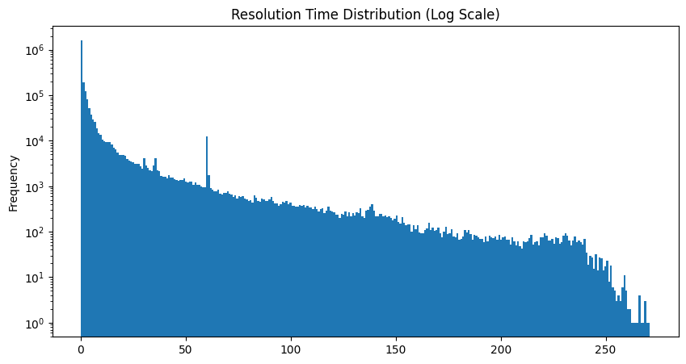
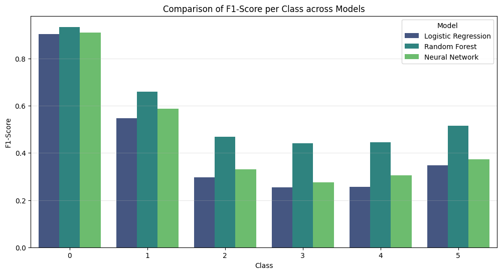
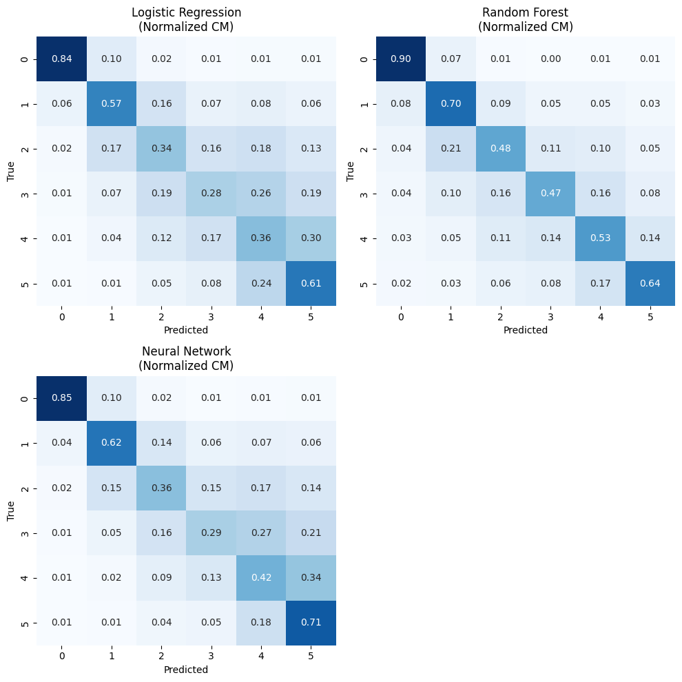
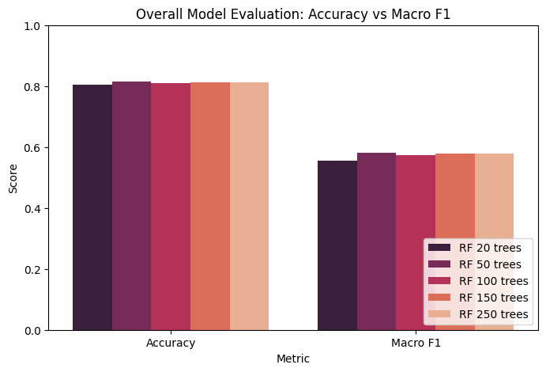
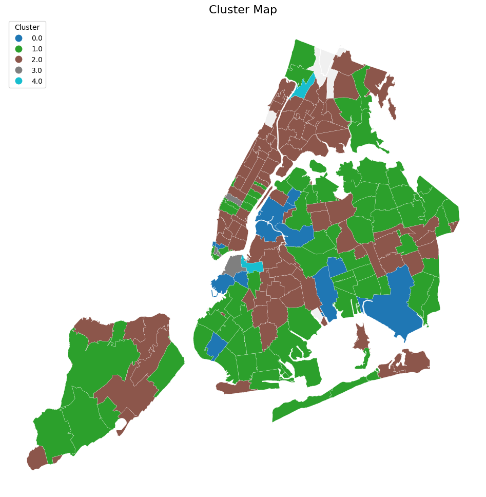
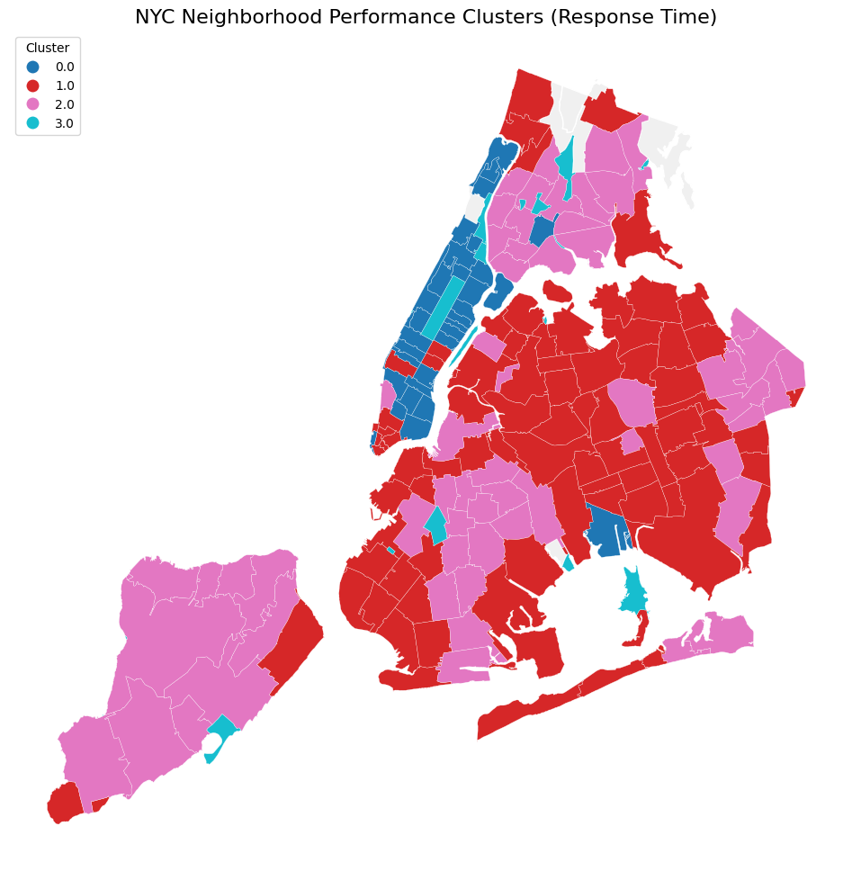

# NYC 311: Predicting Resolution Time & Discovering Spatial Patterns

A data-mining study of **~2.6 million NYC 311 service requests** from 2025. It has two parts:

1. **Supervised classification:** predict how long a new service request will take to resolve, using only information available when it's filed.
2. **Unsupervised clustering:** group NYC ZIP codes by *what* residents complain about and by *how fast* the city responds.

This was the final project for CS521 (Data Mining) at the University of New Mexico, Fall 2025.

---

## Highlights

- Built a cleaning and feature pipeline over 2.6M rows × 41 columns, including a **rolling 24-hour per-ZIP workload feature** that captures how busy each area already is when a request comes in.
- Framed resolution time as a **6-class ordinal problem** (same day → 31–60 days) over a heavily skewed, long-tailed target.
- **Random Forest reaches 81.1% accuracy and 0.57 macro-F1** on 477K held-out requests. That compares with 69.4% for always predicting the majority class, and it beats a Logistic Regression baseline, a Neural Network, and XGBoost.
- K-Means over ZIP-level complaint mixes finds clear neighborhood types: parking-dominated, residential noise plus heat/hot water, and street-vendor hotspots. A second clustering on resolution speed shows a **10× gap in median response time** between the fastest and slowest groups of ZIPs.

## Data

[NYC 311 Service Requests](https://data.cityofnewyork.us/Social-Services/311-Service-Requests-from-2010-to-Present/erm2-nwe9), from NYC Open Data.

| Stage | Rows |
|---|---|
| Raw export (41 columns) | 2,596,041 |
| After cleaning (closed with a valid close date, has coordinates, 19 sparse columns dropped) | 2,449,109 |
| Classification set (resolution ≤ 60 days) | 2,386,288 |

Resolution time is extremely right-skewed. The median is **4.3 hours**, the mean is **5.3 days**, and the maximum is 271 days. Requests over 60 days (about 3%) were dropped as outliers before classification.

<p align="center"></p>

## Part 1: Predicting Resolution Time

### Target classes

| Class | `0` | `1` | `2` | `3` | `4` | `5` |
|---|---|---|---|---|---|---|
| Days to close | < 1 | 1–3 | 4–7 | 8–14 | 15–30 | 31–60 |
| Share of test set | 69.4% | 15.9% | 5.7% | 3.6% | 3.2% | 2.2% |

### Features

Only information available **when the request is created** is used:

- **Categorical:** Agency, Complaint Type, Descriptor, Location Type, Incident ZIP, City, Borough, Open Data Channel Type
- **Spatial:** Latitude, Longitude
- **Temporal:** hour of day, day of week, month, is-weekend
- **Workload:** `open_requests_past_24h`, the number of requests filed in the same ZIP over the previous 24 hours (a rolling window, `closed='left'` so it doesn't leak the current request)

### Setup

80/20 stratified train/test split, 3-fold stratified CV on the training set scored by macro-F1, and `class_weight='balanced'` for LR and RF to counter the 69% majority class.

### Results (test set, n = 477,258)

| Model | Accuracy | Macro F1 |
|---|---|---|
| Majority class | 69.4% | — |
| Logistic Regression (one-hot + scaling) | 72.8% | 0.43 |
| Neural Network | ~75% | ~0.46 |
| XGBoost (100 trees, depth 8) | 79.8% | 0.45 |
| **Random Forest** (150 trees, ordinal encoding) | **81.1%** | **0.57** |

<p align="center"></p>

<p align="center"></p>

**Observations:**

- Random Forest is the best model on every class, and its lead is largest on the rare middle buckets (4–30 days), where the other models' F1 falls to about 0.25–0.35.
- XGBoost comes close on accuracy but mostly by favouring the fast classes. Without class weighting, its recall on class `3` (8–14 days) falls to 0.14.
- Most errors fall in *adjacent* buckets (for example, 4–7 predicted as 1–3), as expected for an ordinal target where the boundaries are somewhat arbitrary.
- **Tree-count sweep:** Random Forest performance levels off at about 50 trees. Going from 50 to 250 trees changes accuracy and macro-F1 by less than one point.

<p align="center"></p>

## Part 2: Spatial Clustering of ZIP Codes

### Complaint-mix profiles

For each ZIP, the share of each of the 50 most common complaint types, clustered with K-Means (k = 5, chosen with the elbow method).

| Cluster | ZIPs | Dominant complaints | Profile |
|---|---|---|---|
| 0 | 24 | **Illegal parking (54%)**, blocked driveway | Parking-dominated |
| 1 | 95 | Illegal parking (24%), residential noise, homeless-person assistance | Mixed, outer-borough |
| 2 | 102 | **Residential noise (13%), heat/hot water (8%)** | Dense residential housing |
| 3 | 18 | **Vendor enforcement (47%)**, traffic signals | Commercial and tourist hotspots |
| 4 | 5 | Consumer complaints (73%), dead animals | Very low-volume ZIPs |

<p align="center"></p>

### Service-performance profiles

For each ZIP: median, mean, and standard deviation of resolution time, plus the share of "slow" tickets (above the city-wide 80th percentile). These features are standardized and clustered with K-Means (k = 4).

| Cluster | ZIPs | Median resolution | Mean resolution | % slow tickets |
|---|---|---|---|---|
| 1 (fastest) | 88 | 2.9 h | 4.0 days | 15% |
| 0 | 37 | 6.9 h | 9.1 days | 24% |
| 2 | 65 | 8.0 h | 5.5 days | 24% |
| 3 (slowest) | 4 | 30.3 h | 15.6 days | 39% |

<p align="center"></p>

The two clusterings together point to areas where resources could be reallocated. ZIPs whose complaint mix leans toward slow-resolving categories, and that also fall into slower performance clusters, are the obvious candidates for SLA review.

## Repository Structure

```
.
├── geo_data.geojson                        # NYC ZIP code boundaries (for maps)
├── images/                                 # Figures used in this README
├── results/class_distribution.png
├── requirements.txt
└── src/
    ├── init.ipynb                          # CSV → Parquet, profiling, missing values, duplicates
    ├── cleaning.ipynb                      # Type conversion, filtering, category cleanup
    ├── supervised_feature_engineering.ipynb# Temporal + rolling workload features, target buckets
    ├── logistic_regression.ipynb           # Baseline classifier
    ├── random_forest_classifier.ipynb      # Best classifier, EDA plots, tree-count runs
    ├── xgboost_classifier.ipynb            # Gradient-boosted trees
    ├── comparision.ipynb                   # Model comparison: confusion matrices, F1, ROC / PR curves
    ├── LightGBM.ipynb                      # Exploratory Bayesian network (pgmpy)
    └── clustering/
        ├── issue_profile.ipynb             # Complaint-mix K-Means
        ├── performance_profile.ipynb       # Response-time K-Means
        └── utils.py                        # Elbow plot + choropleth helpers
```

## Reproducing

```bash
python -m venv venv && source venv/bin/activate
pip install -r requirements.txt
```

1. Export the 311 service requests from [NYC Open Data](https://data.cityofnewyork.us/Social-Services/311-Service-Requests-from-2010-to-Present/erm2-nwe9) as CSV and save it as `dataset.csv` in the **parent directory** of this repo. The notebooks read and write data at `../`, so the large files stay outside the repo.
2. Run the notebooks in order:
   `init` → `cleaning` → `supervised_feature_engineering` → the classifier notebooks (each saves its test-set predictions to `results/*.npy`) → `comparision`. The `clustering/*` notebooks only need `cleaned_data.parquet`.

Random Forest on about 1.9M training rows needs a fair amount of RAM. 16 GB or more is recommended.

## Tech Stack

Python · pandas / PyArrow · scikit-learn · XGBoost · GeoPandas · Matplotlib / Seaborn · Jupyter
